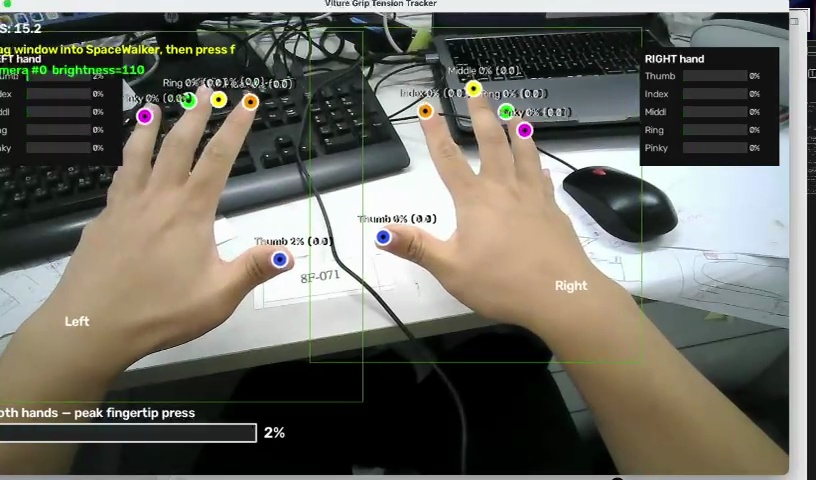
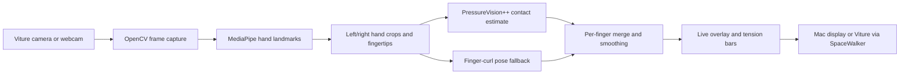
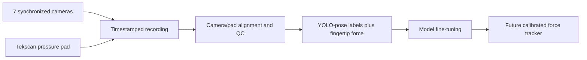

# Viture Grip Tension Tracker

Viture is a real-time, camera-based grip and fingertip tension tracker designed to support physiotherapy screening. It turns hand movement and contact into a live per-finger readout that is easier to compare over time than relying only on a subjective 1–10 rating.

The tracker can use the camera on Viture XR glasses or a normal webcam, follow both hands, estimate the relative loading of each fingertip, and display the result on the computer or inside the glasses through SpaceWalker.

> **Prototype status:** the current live tracker estimates relative grip/contact effort from RGB video. It is not yet a clinically validated measurement of muscle activation or absolute force, and it does not replace pain scores, EMG, dynamometry, or professional judgement. The included multi-camera + pressure-pad pipeline is the path toward calibrated force readings.

## Why this project

Traditional screening often includes a patient-reported 1–10 score. That score is useful, but it is subjective and may change with the patient's interpretation, memory, or tolerance.

Viture adds a quantitative signal that a physiotherapist can observe during a movement:

- separate readings for the thumb, index, middle, ring, and little finger;
- left- and right-hand comparison;
- live feedback while the patient grips, presses, or relaxes;
- repeatable recordings that can support comparison between sessions; and
- a pressure-pad training workflow for moving from relative estimates toward calibrated force.

The intended use is to **supplement** patient feedback with an observable measurement, not to diagnose a condition on its own.

## Demo

[](docs/demo.mp4)

**[Watch the 13-second demo video](docs/demo.mp4).** The coloured fingertip markers and side panels change as both hands open, close, and make contact. The bottom bar shows the highest estimated fingertip load across both hands.

## Architecture



### Live tracking flow

1. OpenCV reads the selected camera.
2. MediaPipe detects up to two hands and locates the five fingertips on each hand.
3. PressureVision++ estimates contact pressure from each hand crop.
4. If the pressure model does not detect contact, a finger-curl pose estimate keeps the interface responsive.
5. The readings are smoothed and drawn as per-finger percentages, fingertip markers, and a combined peak bar.

### Calibrated-data flow



The collection tools synchronize multi-view RGB frames with pressure-pad measurements, align the pressure map to the image, and export pose labels with per-fingertip force targets. See [V2_README.md](V2_README.md) and [docs/MULTICAM_FORCE_DATASET.md](docs/MULTICAM_FORCE_DATASET.md).

## Current output

- Both-hand tracking with separate left and right panels
- Thumb, index, middle, ring, and little-finger readings
- PressureVision++ contact estimates with a pose-based fallback
- Adaptive scaling and smoothing for a stable first-person view
- Optional Viture XR presentation through SpaceWalker
- Seven-camera + pressure-pad dataset collection and quality-control tools

## Quick start on macOS

### 1. Clone the repository

```bash
git clone --recurse-submodules https://github.com/davidcheung0128/Viture.git
cd Viture
```

### 2. Create the environment

```bash
python3 -m venv .venv
source .venv/bin/activate
python -m pip install --upgrade pip
python -m pip install torch torchvision
python -m pip install -e external/segmentation_models.pytorch
python -m pip install -r external/pressurevision2/requirements.txt
python -m pip install -r requirements.txt
```

### 3. Download the PressureVision++ checkpoint

```bash
curl -L -o weights/paper_29.pth "https://www.dropbox.com/scl/fi/0r2koefy7bhr66dffc8z7/paper_29.pth?rlkey=wshcxm8iy8l1qo60oo7khdqjp&dl=1"
```

The file should be about 148 MB. The MediaPipe model, `weights/hand_landmarker.task`, is already included.

### 4. Allow camera access

Open **System Settings → Privacy & Security → Camera**, enable access for Terminal or iTerm, then restart that application.

### 5. Run the tracker

```bash
python viture_tension_tracker.py --auto-camera --device mps
```

To prepare the display for Viture glasses:

```bash
python viture_tension_tracker.py --auto-camera --device mps --project-glasses
```

Open SpaceWalker, pin the **Viture Grip Tension Tracker** window, focus it, and press `f` for fullscreen. Press `q` to quit.

## Useful options

| Option | Purpose |
|---|---|
| `--list-cameras` | Probe camera inputs and save preview images |
| `--camera-index N` | Select a specific OpenCV camera index |
| `--auto-camera` | Prefer a usable non-Continuity camera |
| `--allow-continuity` | Allow an iPhone Continuity Camera |
| `--device mps\|cuda\|cpu` | Select the inference device |
| `--project-glasses` | Show Viture/SpaceWalker projection instructions |
| `--gain 2.0` | Adjust contact-probability amplification |
| `--smooth 0.5` | Adjust per-finger exponential smoothing |
| `--max-force 16` | Set the fixed-force display scale |
| `--no-fpv-adaptive` | Disable adaptive first-person scaling |
| `--show-skeleton` | Draw the MediaPipe hand skeleton |
| `--mirror` | Flip the camera image horizontally |

## Pressure-pad data collection

The repository also includes a dry-run mode, camera discovery, pad calibration, synchronized recording, dataset building, and force-overlay quality control.

```bash
# Verify the pipeline without hardware
python scripts/v2_collect.py --dry-run --participant p01 --seconds 2 --auto-build

# Find and configure real cameras
python scripts/list_cameras.py

# Record after configuring the cameras and Tekscan integration
python scripts/calibrate_pad_markers.py
python scripts/v2_collect.py --participant p01 --backend tekscan --auto-build
```

## Repository map

```text
Viture/
├── viture_tension_tracker.py        # Live two-hand tracker and UI
├── scripts/v2_collect.py            # Interactive collection workflow
├── scripts/record_multicam_force.py # Synchronized recorder
├── scripts/build_force_pose_dataset.py
├── scripts/qc_force_overlay.py      # Pressure/image alignment check
├── forcepad/                        # Mock and Tekscan pad interfaces
├── config/multicam_force.yml        # Camera and synchronization settings
├── docs/                            # Demo and data-pipeline documentation
└── weights/                         # MediaPipe model and PV++ checkpoint location
```

## Known limitations

- RGB-only output is an estimate, not a direct measurement of muscle tension or EMG activity.
- Percentages from the pose fallback describe relative hand posture; they are not Newtons.
- Absolute-force accuracy requires pressure-pad ground truth, model fine-tuning, and validation on representative participants and movements.
- Camera angle, lighting, occlusion, and gloves can affect hand tracking.
- Clinical use requires an appropriate validation study and should retain the physiotherapist's assessment and the patient's reported symptoms.

## Troubleshooting

| Problem | Suggested fix |
|---|---|
| Camera cannot open | Enable Camera permission, close other camera apps, and run `--list-cameras` |
| Black window or no hands | Select another camera index or use `--auto-camera` |
| Window is not visible in the glasses | Pin the tracker window in SpaceWalker, then press `f` |
| All fingers stay at 0% | Try a visible grip/curl; flat presses need the calibrated training path |
| `No module named pretrainedmodels` | Run `python -m pip install -r requirements.txt` |
| Missing model checkpoint | Download `weights/paper_29.pth` as shown above |
